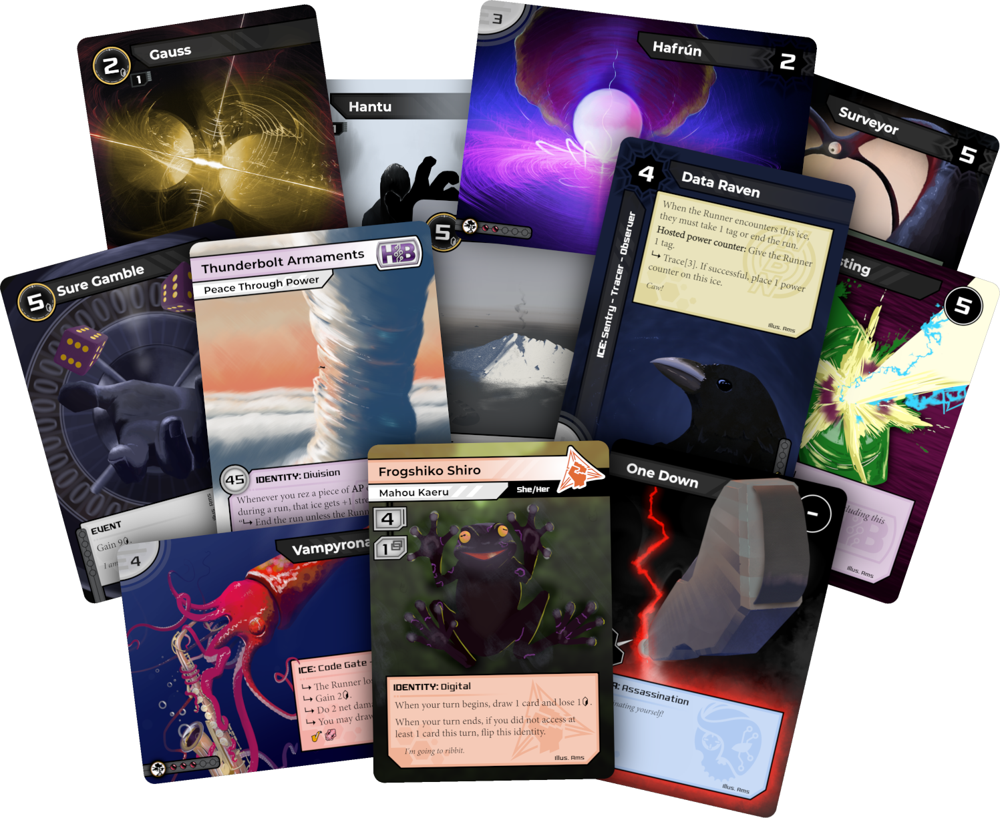

# Ams' Netrunner Frames

This is a collection of full-bleed Netrunner frames for use in creating Netrunner alt arts and custom cards.

I recommend you read this document, even if briefly, before using these files. There are a lot of layers, many providing hidden features and caveats.

If you need any help creating cards with my frames, or find any issues with these assets, please do not hesitate to contact me! I am `@distributive` on Discord (please first find me at `discord.gg/glc` if we have not spoken before). I will not help you put frames on AI-generated images.

Before printing your alt arts, ensure they conform to Null Signal Games' organised play policies: https://nullsignal.games/organizers/organized-play-policies/ (apendix III).

All placeholder art is my own.

---
## Requirements

The .xcf files contained within were made with GIMP, a free and open-source image editor. You are free to attempt to attempt to modify these files using any editor of your choice, but I cannot guarantee they will convert cleanly.

The files also use fonts that may not already be installed on your computer. You should install these fonts and ensure they are accessible in GIMP (or your chosen editor) before opening them.

The fonts used in these frames are:
- Minion Pro
- Monkirta Pursuit NC
- Montserrat Bold

You are free to use any fonts you choose, but note that the text boxes were designed and scaled around these specific fonts, and you may have to resize them if you choose different fonts.

---
## Choosing factions

**Important:** *by default, the influence bar on agendas is invisible. For neutral agendas this is incorrect, and will make your alt arts illegal for competitive play if you don't show them. For ease of use, I have make a duplicate of the agenda frame with the influence shown by default in `agendaNeutral.xcf`.*

**Note:** *You can choose new colours for each faction by modifying the layers described in this section.*

Each file contains everything you need to make an alt art for a single card type (e.g. program). This include all faction variants of that card type. By default, the neutral colour palette is set. To create an alt art for any other faction, you will need to hide and show specific layers.

Hide all layers in `Text Boxes/Bottom Text Box/BTB Primary/BTB Primary Colours` and `Text Boxes/Bottom Text Box/BTB Secondary Colours` except the two layers corresponding to your desired faction.

If you do not want to use the darker default frames for the title boxes, and instead use ones coloured to match the card's faction, hide all layer groups in `Text Boxes/Top Text Box/TTB Factions` except the group matching your desired faction. If you do, you will need to change the colour of the title text to black (unless you are making an Apex card).

If you do not want to use the default neutral grey influence pips, hide all layer groups in `Influence/Influence Factions` except the one corresponding to your desired faction. You may also optionally choose to choose the simplified flat versions of the influence pips by hiding the `Pips` layer within that group and swapping it with the `Pips Simple` layer. 

For identities, you will also need to hide all layer groups in `Text Boxes/Faction Indicators` except the one matching your desired faction.

---
## Exception layers

Sometimes text aligns inconsistently depending on its contents. In the case of some numbers, these has been noticed and remedied by adding additional layers that you can select from as and when you need them. Note that these exception layers were made with the aforementioned fonts in mind.
- Agenda points of 1 don't align properly, so a separate layer has been made for that.
- Runner deckbuilding stats don't align consistently across different values, so the three main deck constraints (40, 45, and 50) have been manually centered in separate layers.

---
## Optional layers

There are optional layers in each frame that allow you to customise your alt arts without making any manual edits.

### Text box details

Many of the details and textures within each text box are separated into layers. You can look through the `Text Boxes` layer group and its child groups to try out the options.

### Inverted text boxes

By default, the title text box (and side bar on portrait ice) uses an inverted colour scheme. To disable this, see the **Choosing factions** section.

### Influence

By default, the influence bar on each card uses pips with a 3D effect. You can swap to a simplified flat version by hiding `Influence/Influence Factions/Influence <faction>/<faction> Pips` and showing the `<faction> Pips Simple layer` instead.

You can also change the style of the influence bar by hiding/showing `Influence/Inf Decoration` and `Influence/Inf Decoration Simple`.

### Fading

The top and bottom text boxes (and side bar on portrait ice) have two layers hidden by default: `Holographic Erase` and `Fade Out`. These provide gradients to their text boxes that add transparency. If you are interested in using these, I recommend implementing them on a card-by-card basis, and some arts will make text illegible if the text boxes are not opaque.

You can remedy this issue by blurring the art underneath the frames:
- Copy the layer in `Art` containing your alt art.
- Apply a Gaussian blur (in GIMP it is in `Filters/Blur/Gaussian Blur…`) with a strength of your choice.
- Select the transparent frame in its layer using the fuzzy select/magic wand tool.
- Return to your blurred copy of the artwork, and copy it using the selected area from the frame.
- Paste this in a new layer.
- Delete the previous blurred layer.
- You should be left with a layer that contains a blurred version of your art, but only under the transparent frame.

---
## Double-sided identities

The two identity files can be modified to create the reverse side of identities with multiple sides. To do this, you must hide:
- `Text Boxes/Bottom Text Box/ID Stats`
- `Texts/Decksize`
- `Texts/Influence`
This will hide the deckbuilding stats that are only present on the front side of identity cards.

Additionally, if you are making a Runner identity, you may wish to hide `Texts/Illus.` and replace it with `Texts/Illus. Identity Back`. This is a repositioned text box for the illustrator credit to account for the different layout.

---
## Portrait ice

By convention, most full-bleed alt arts for ice cards are displayed landscape, as opposed to the portrait layout used in the original printings. I have provided an option for full-bleed portrait ice, but it comes with three caveats:
- There is an additional text box in `Text Boxes/Side Bar`. Any changes applied to `Text Boxes/Top Text Box` should also be applied to this for consistency.
- GIMP does not allow for text to be rotated without rasterisation (transforming it from text data into pixels). As such, editing the side bar text (for types/subtypes) will lose the layout data of the file. To get around this, I recommend copying the title text (`Texts/Title`), editing that to contain the type data (note: by convention the type is bolded and uppercase), then rotating that text box and using `Texts/Type` to align is accurately. Once you are done, you can delete `Texts/Type`.
- To solve this rotation issue with the strength text, all plausible ice strengths (0-9, "X") and "-" have been remade and rotated 90 degrees. You simply have to show the layer corresponding to the strength you want and not worry about rotating anything.

---
## Apex

Apex is an outlier in the Runner card frames as it uses the same colour palette as the "inverted" title boxes but with the colours swapped. As such, it comes with some recommendations:
- If you are making an Apex identity alt art, it is advised to hide the title bar gradient (helpfully labelled `Text Boxes/Top Text Box/TTB Gradient (disable for Apex)`).
- It is suggested you use the Apex top text box instead of the inverted text box for consistency with the bottom text box.

---
### Making edits

Where feasible, I have ensured features of these frames can be moved around with minimal effort. However, in some cases (notably with the influence bars and their outlines) it is possible you may need to remake certain features. These are how I made various aspects of the frames: 
- The black outlines of text boxes have a width of 20px, and were created by selecting the area they were to contain and expanding the selection by 20px.
- The inner border of text boxes has a thickness of 30px, and was created by selecting the space inside the black outline and shrinking the selection by 30px.
- The blurred backgrounds of the faction icons on the influence bars were created with the following process:
    - Copy the faction icon to a lower layer.
    - Use a contrast tool to make it a solid black fill.
    - Apply a Gaussian blur with  size of 30px.
    - If necessary, copy and paste until it is the transparency desired.
